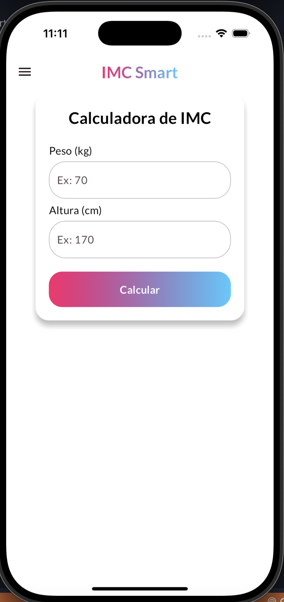
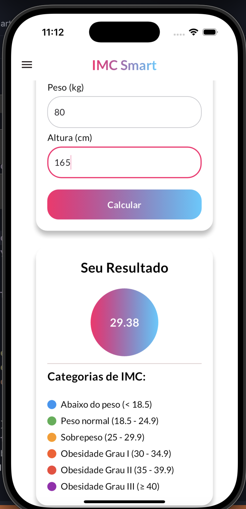
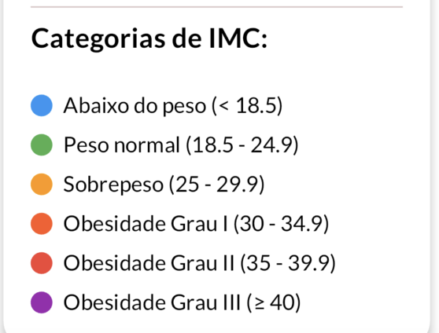

# Calculadora de IMC - Flutter 📱

[](https://flutter.dev)
[](LICENSE)

Um aplicativo intuitivo para cálculo de Índice de Massa Corporal (IMC) com visualização de categorias e interface moderna.

<p align="center">
  
</p>

## 📸 Capturas de Tela

<div align="center">
  
  
<!--    -->
</div>

## ✨ Funcionalidades

- ✅ Cálculo instantâneo de IMC
- 🎨 Interface visual com feedback dinâmico
- 📊 Categorias coloridas com marcadores
- 📱 Layout responsivo para dispositivos móveis
- 🚨 Validação de campos de entrada
- 🌗 Suporte a temas claro/escuro

## 🛠️ Como Executar

### Pré-requisitos
- Flutter SDK 3.0+
- Dispositivo/Emulador Android ou iOS

### Instalação
1. Clone o repositório:
```bash
git clone https://github.com/hpzynha/calculadora-imc-flutter.git
